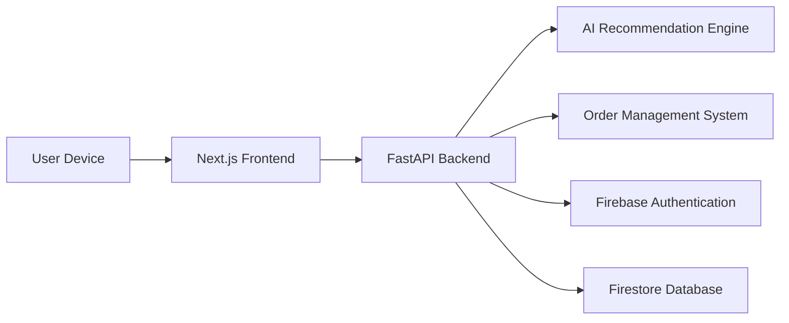
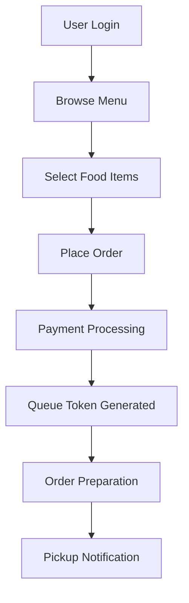
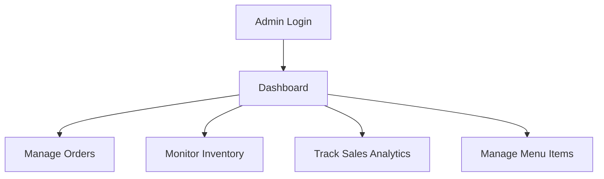

<!-- ========================================================= -->
<!--                    CANTEENFLOW AI                         -->
<!-- ========================================================= -->

<div align="center">


<br>


<h1>🍽️ CanteenFlow AI</h1>

<p><strong>AI-Powered Smart Canteen Management & Food Ordering Ecosystem</strong></p>

<p>
  
  
  
  
  
  
</p>

<br/>

### 🌐 Live Demo  
⚠️ Not deployed yet  
This project is currently running in local development mode. Deployment will be added soon (Vercel + Render).


> **Reimagining canteen operations with AI-driven automation, analytics, and seamless ordering experiences.**

</div>

---

# 📚 Table of Contents

1. Project Overview  
2. Core Features  
3. Real-World Problem Flow  
4. AI-Powered Smart Ecosystem  
5. System Architecture  
6. User Journey Flow  
7. Technical Stack  
8. Project Structure  
9. Security Posture  
10. Installation & Local Setup  
11. API Endpoints  
12. Deployment  
13. Challenges Faced During Development  
14. Contribution Guide  
15. Disclaimer  
16. Author & License  

---

# 1. 🚀 Project Overview

CanteenFlow AI is a next-generation AI-powered smart canteen management platform designed to optimize food ordering, queue management, inventory tracking, and customer experience.

The platform combines:

- AI-powered food recommendations
- Real-time order management
- Smart queue optimization
- Inventory analytics
- Digital payments
- Role-based dashboards
- Sales intelligence

CanteenFlow AI transforms traditional cafeteria systems into fully digitized, scalable, and intelligent food service ecosystems.

---

# 2. 🌟 Core Features

## 2.1 Smart Food Ordering System

- Digital menu browsing
- Real-time order placement
- Live order tracking
- Smart estimated wait times
- Contactless ordering experience

---

## 2.2 AI Recommendation Engine

- Personalized meal suggestions
- Trending food analysis
- Purchase pattern detection
- AI-based upselling recommendations
- Customer preference learning

---

## 2.3 Real-Time Queue Management

- Smart token generation
- Queue optimization
- Rush-hour load balancing
- Live preparation tracking
- Reduced waiting times

---

## 2.4 Admin Analytics Dashboard

- Daily sales analytics
- Peak-hour monitoring
- Inventory insights
- Revenue visualization
- Popular item tracking

---

## 2.5 Inventory & Stock Management

- Real-time inventory tracking
- Low-stock alerts
- Automated stock monitoring
- Ingredient usage analytics
- Waste reduction insights

---

## 2.6 Authentication System

- Firebase Authentication
- Google OAuth
- Secure session management
- Role-based access control

---

# 3. 🚨 Real-World Problem Flow

## The Traditional Canteen Experience

In most schools, colleges, universities, offices, and corporate cafeterias, food ordering is still highly manual, slow, and inefficient.

During break hours or lunch rushes, hundreds of students and employees attempt to order food simultaneously, creating long queues, confusion, delays, and poor customer experiences.

---

```text
Enter Canteen
      ↓
Search for Menu Board
      ↓
Stand in Long Queue
      ↓
Wait to Place Order
      ↓
Wait for Manual Bill Generation
      ↓
Pay at Counter
      ↓
Walk to Another Counter
      ↓
Hand Over Paper Bill
      ↓
Cook Tries to Read Order
      ↓
Noise & Crowd Confusion
      ↓
Order Gets Delayed or Misheard
      ↓
Wait Again for Food
      ↓
Try Hearing Token Number
      ↓
Search for Seating
      ↓
Break Time Almost Over
      ↓
Customer Leaves Frustrated
```

---

# 🚫 Major Problems in Existing Systems

## ⏳ Long Waiting Queues

- Customers spend excessive time standing in lines
- Manual ordering slows down the workflow
- Billing delays increase congestion
- Peak hours become chaotic

---

## 🔊 Noise & Communication Problems

- Customers miss token announcements
- Staff struggle to communicate
- Wrong orders are picked up
- Crowded environments create confusion

---

## 📄 Manual Billing Dependency

- Handwritten bills slow operations
- Printed slips can get lost
- Duplicate order confusion occurs
- Cash handling delays the process

---

## 🍔 Kitchen Order Mismanagement

- Orders become difficult to track
- Kitchen staff receive unclear instructions
- Customization requests are missed
- Food preparation coordination becomes inefficient

---

## ⌛ Break Time Wastage

Students and employees waste valuable time:

- standing in queues
- waiting for food
- searching for seats
- missing break schedules

---

# ✅ How CanteenFlow AI Solves This

```text
Mobile Ordering
      ↓
Instant Digital Payment
      ↓
AI Queue Optimization
      ↓
Real-Time Kitchen Sync
      ↓
Live Order Tracking
      ↓
Smart Pickup Notifications
      ↓
Reduced Waiting Time
      ↓
Faster Food Delivery
      ↓
Better Customer Experience
```

---

# 4. 🧠 AI-Powered Smart Ecosystem

## 4.1 Intelligent Food Recommendation Engine

The AI engine analyzes:

- Customer order history
- Trending items
- Time-based ordering patterns
- Seasonal demand
- User preferences

to generate personalized food recommendations.

---

## 4.2 Smart Queue Optimization

The platform intelligently predicts:

1. Peak traffic periods
2. Average preparation times
3. Counter workload distribution
4. Queue congestion risks
5. Resource allocation efficiency

---

## 4.3 Sales & Demand Forecasting

AI-powered analytics help administrators:

- Forecast food demand
- Optimize inventory purchases
- Reduce food wastage
- Improve operational efficiency
- Maximize revenue generation

---

# 5. 🏗️ System Architecture



---

# 6. 🔄 User Journey Flow

## 6.1 Customer Ordering Flow



---

## 6.2 Admin Management Flow



---

# 7. ⚙️ Technical Stack

## Frontend (Customer App)
- React (Vite)
- TypeScript
- Tailwind CSS
- ShadCN/UI (component system)
- Custom Hooks Architecture

---

## Backend (API Server)
- Node.js
- Express.js
- TypeScript
- Server-Sent Events (SSE)
- Modular REST APIs
- Middleware-based architecture

---

## Database
- Drizzle ORM
- PostgreSQL (Neon)

---

## Authentication & Security
- Clerk Proxy Middleware
- Role-based access control
- Secure API routing

---

## Real-Time System
- Server-Sent Events (SSE)
- Live order updates
- Notification streaming system

---

## AI / Smart Logic Layer
- Orchestrator-based recommendation engine
- Rule-based + behavioral analytics system
- Smart ordering optimization logic

---

## Shared Packages (Monorepo)
- API Client (React SDK)
- OpenAPI Spec (orval-generated)
- Zod validation schemas
- Database schema package (Drizzle)

---

## Tooling / Monorepo
- pnpm Workspaces
- TypeScript Project References
- Modular package architecture

---

## Deployment
- Vercel (Frontend)
- Render (Backend API)
- Neon (PostgreSQL Cloud DB)

---

# 8. 📁 Project Structure

```bash
CanteenFlowWithAI/
│
├── artifacts/
│   ├── api-server/                # Backend API server
│   │   ├── src/
│   │   │   ├── routes/            # API route handlers
│   │   │   ├── middlewares/       # Authentication & request middleware
│   │   │   ├── lib/               # SSE, orchestrator, logging utilities
│   │   │   └── app.ts             # Express/Fastify app configuration
│   │   └── package.json
│   │
│   ├── canteenflow/               # Main frontend application
│   │   ├── src/
│   │   │   ├── components/        # Reusable UI components
│   │   │   ├── hooks/             # Custom React hooks
│   │   │   ├── lib/               # API utilities & helpers
│   │   │   ├── pages/             # Application pages
│   │   │   └── App.tsx
│   │   └── package.json
│   │
│   └── mockup-sandbox/            # UI experimentation & mockup environment
│
├── lib/
│   ├── api-client-react/          # Shared API client package
│   ├── api-spec/                  # OpenAPI specifications
│   ├── api-zod/                   # Shared Zod schemas
│   └── db/                        # Database schema & Drizzle ORM
│
├── scripts/                       # Seed scripts & utilities
│
├── package.json
├── pnpm-workspace.yaml            # Monorepo workspace config
├── tsconfig.base.json
└── README.md
```

---

# 9. 🔒 Security Posture

- 🔐 HTTPS-secured APIs
- 🛡️ Firebase OAuth authentication
- 🔒 Protected admin routes
- ☁️ Secure cloud synchronization
- ✅ Session persistence
- 🚫 No raw password storage

---

# 10. ⚡ Installation & Local Setup

## Clone Repository

```bash
git clone https://github.com/Iqra-Fatima-07/CanteenFlow-AI.git
cd CanteenFlow-AI
```

---
## Frontend Setup

```bash
cd artifacts/canteenflow
pnpm install
pnpm dev
```


---

## ⚡ Backend Setup (Node + Express + TypeScript)

```bash
cd artifacts/api-server
pnpm install
pnpm dev
```
---
# 11. 🔌 API Endpoints

## 🍔 Menu & Orders
| Method | Endpoint | Description |
|---|---|---|
| GET | /menu | Fetch menu items |
| POST | /orders | Create new order |
| GET | /orders | Get all orders |
| GET | /orders/:id | Get order details |

---

## 🧠 AI System
| Method | Endpoint | Description |
|---|---|---|
| POST | /ai | Get recommendations |
| GET | /ai | Get AI insights |

---

## 📊 Dashboard
| Method | Endpoint | Description |
|---|---|---|
| GET | /dashboard | Admin dashboard data |
| GET | /analytics | Sales analytics |

---

## 🔔 Real-Time Updates (SSE)
| Method | Endpoint | Description |
|---|---|---|
| GET | /notifications | Live updates stream |

---

# 12. 🚀 Deployment

## 🎨 Frontend Deployment
- Vercel (Next.js / Vite frontend)

---

## ⚙️ Backend Deployment
- Render (Node.js + Express API server)

---

## 🗄️ Database
- Neon PostgreSQL (via Drizzle ORM)

---

# 13. 🧩 Challenges Faced During Development

Building CanteenFlow AI involved solving multiple real-world technical and architectural challenges across frontend engineering, backend systems, AI integration, and scalability.

---

## 13.1 Real-Time Order Synchronization

One of the biggest challenges was maintaining real-time synchronization between:

- Customer orders
- Kitchen preparation status
- Admin dashboards
- Queue tracking systems

Handling simultaneous updates without creating inconsistent states required careful state management and optimized backend communication flows.

---

## 13.2 Queue Management Optimization

Designing an intelligent queue management system was challenging because the platform needed to:

- Handle peak-hour traffic
- Prevent duplicate token generation
- Reduce wait-time bottlenecks
- Dynamically prioritize preparation queues

This required implementing optimized queue logic and live status updates.

---

## 13.3 AI Recommendation Accuracy

Creating meaningful food recommendations required balancing:

- User preferences
- Order history
- Trending food items
- Time-based demand patterns

Improving recommendation relevance while keeping response times fast was a major optimization challenge.

---

## 13.4 Scalable Frontend Architecture

Challenges included:

- Reusable component design
- Global state management
- Dashboard responsiveness
- Preventing unnecessary re-renders
- Maintaining smooth UI performance

---

## 13.5 Backend API Optimization

The backend needed to efficiently process:

- Concurrent order requests
- Inventory updates
- Analytics calculations
- AI recommendation logic

---

## 13.6 Inventory Consistency

Keeping inventory synchronized with live customer orders introduced challenges such as:

- Race conditions
- Simultaneous stock updates
- Overselling prevention
- Real-time availability tracking

---

## 13.7 Authentication & Security

Implementing secure authentication involved:

- Firebase OAuth integration
- Protected route handling
- Role-based access control
- Secure session persistence

---

## 13.8 Deployment & Environment Configuration

Challenges included:

- Environment variable synchronization
- Cross-origin API communication
- Production build compatibility
- Backend deployment configuration

---

## 13.9 Responsive Dashboard Design

Creating dashboards that worked smoothly across:

- Mobile devices
- Tablets
- Large desktop screens

required extensive responsive UI optimization.

---

# 14. 🤝 Contribution Guide

## Commit Structure

```bash
type(scope): short description
```

Examples:

```bash
feat(ai): add smart recommendation engine
fix(queue): resolve token generation issue
docs(readme): improve documentation
```

---

# 15. ⚠️ Disclaimer

CanteenFlow AI is designed for educational, research, and operational management purposes.

---

# 16. 👨‍💻 Author & License

## Author

Iqra Fatima  
AI Engineer | Full-Stack Developer | AI Systems Builder

GitHub Profile: 

https://github.com/Iqra-Fatima-07

Repository:

https://github.com/Iqra-Fatima-07/CanteenFlow-AI

---

## License

This project is licensed under the MIT License.

---

<div align="center">

### ⭐ If you found this project useful, consider starring the repository!
<p align="center">
  Made with ❤️ by <strong>Iqra Fatima</strong>
</p>

<div align="center">


</div>
